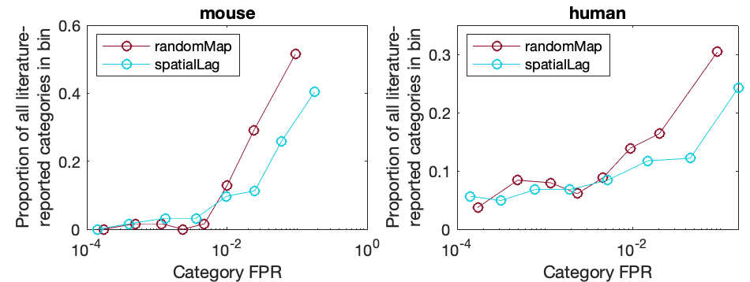
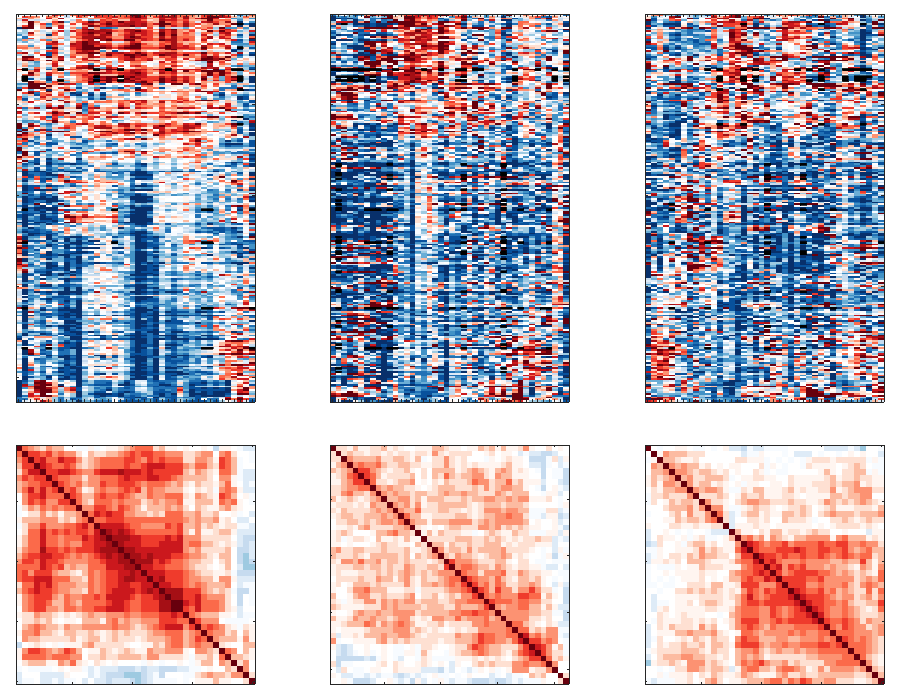
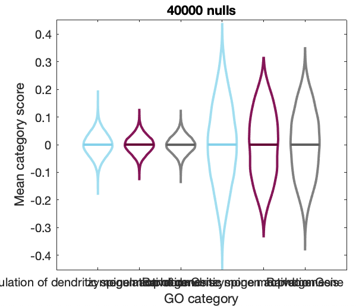

# Appropriate statistical inference for gene-set enrichment analyses (GSEA) of brain-wide transcriptomic data
This is a repository to accompany the manuscript 'Appropriate statistical inference for gene-set enrichment analyses of brain-wide transcriptomic data'.
The code below reproduces all statistical tests on GSEA in human and mouse.

All data is available for download from an associated figshare repository.
Downloadable files are labeled as :link:.

## Setting up

### Data and code for running gene set enrichment analysis (GSEA)

This relies on a [Matlab toolbox for GSEA](https://github.com/benfulcher/GeneSetEnrichmentAnalysis), which can be installed by cloning:
```bash
git clone git@github.com:benfulcher/GeneSetEnrichmentAnalysis.git
```
Analyses here require it to be accessible in the path, which can be set by modifying `GiveMeFile` (`'EnrichmentToolbox'`).

Please follow the instructions from that repository to recompute (or download from the figshare repository for this Matlab-GSEA toolbox) the following required data files:
* Direct biological process annotations: `GOTerms_BP.mat`.
* Hierarchically propagated annotations (mouse): `GOAnnotationDirect-mouse-biological_process-Prop.mat`.
* Hierarchically propagated annotations (human): `GOAnnotationDirect-human-biological_process-Prop.mat`.

## Data

### :bust_in_silhouette: ___Human___ :bust_in_silhouette:
These files should be placed in the `HumanData` directory:
* Gene-expression data: `100DS360scaledRobustSigmoidNSGDSQC1Lcortex_ROI_NOdistCorrSurface.mat` (:link:).
* Structural connectivity data (for case study): `HCP_200_15.mat` (:link:) should be placed in the `/HumanData` directory.

For details on gene-expression data, see [this repository](https://github.com/BMHLab/AHBAprocessing).

### :mouse: ___Mouse___ :mouse:
These files should be placed in the `MouseData` directory.
* Gene-expression data: `AllenGeneDataset_19419.mat` (:link:).
* Structural connectivity data (for case study): `Mouse_Connectivity_Data.mat` (:link:).

## Data processing and precomputing

Note that batch job scripts for major bulk computations are in the `BatchComputing` directory.
There are files for mouse-related analyses: `batchAllMouseAnalyses.sh`, and human-related analyses: `batchAllHumanAnalyses.sh`.

### Assembling literature-published enrichment results

Information about enrichment results reported in published studies can be imported and processed by running
```matlab
ImportLiteratureEnrichment(false,true);
```
Results are saved as `LiteratureEnrichmentLoaded.mat` (:link:).
Raw data to run this is in the `LiteratureEnrichmentData` directory (:link:: `LiteratureEnrichment.zip`).

<!--
First type of annotations are manually-curated, from studies that noted enrichment results in-text with no supplementary files for full results: `TableGOBPs.csv`:

The second type are using scripts (in `/DataProcessing/IndividualEnrichmentImportScripts/`) to directly process data provided as supplementary material from the following studies:
* `WhitakerReformatted.xlsx`: Whitaker, K. J. et al. Adolescence is associated with genomically patterned consolidation of the hubs of the human brain connectome. _Proc. Natl. Acad. Sci. USA+ **113**, 201601745–9110 (2016).
* `Vertes-rstb20150362supp1.xlsx`: Vértes, P. E. et al. Gene transcription profiles associated with inter-modular hubs and connection distance in human functional magnetic resonance imaging networks. _Phil. Trans. Roy. Soc. B_ **371**, 20150362 (2016).
* `Fulcher2016_connectedUnconnected_BP_TableS1.csv`, `Fulcher2016_richFeederPeripheral_BP_TableS5.csv`: Fulcher, B. D. & Fornito, A. A transcriptional signature of hub connectivity in the mouse connectome. _Proc. Natl. Acad. Sci. USA_ **113**, 1435–1440 (2016).
* `Tan2013-table-s6-david-200pos-transport.csv`: Tan, P. P. C., French, L. & Pavlidis, P. Neuron-Enriched Gene Expression Patterns are Regionally Anti-Correlated with Oligodendrocyte-Enriched Patterns in the Adult Mouse and Human Brain. Front. Psychiat. 7, (2013).
* `Parkes2017_PC1.txt`, `Parkes2017_PC2.txt`, `Parkes2017_PC5.txt`, `Parkes2017_PC9.txt`: 1.	Parkes, L., Fulcher, B. D., Yücel, M. & Fornito, A. Transcriptional signatures of connectomic subregions of the human striatum. _Genes, Brain and Behavior_ **25**, 1176–663 (2017). -->

### Generate ensembles of spatially autocorrelated brain maps

Generate random maps that include spatial autocorrelation structure (based on the spatial autocorrelation scale of gene expression as a whole).

```matlab
plotSummary = true;
GenerateSpatialEnsemble('mouse','all',plotSummary)
GenerateSpatialEnsemble('mouse','cortex',plotSummary)
GenerateSpatialEnsemble('human','cortex',plotSummary)
```

Saves into the `SurrogateMaps/` directory:
* `human_Surrogate_N40000.mat` (:link:)
* `mouse_all_Surrogate_N40000.mat` (:link:)
* `mouse_cortex_Surrogate_N40000.mat` (:link:) (for case study)

See also a more comprehensive method for generating spatially autocorrelated brain maps (and matching them to a given phenotype): [brainSMASH](https://github.com/murraylab/brainsmash).

### Category False-Positive Rates (CFPRs)

False-positive significance rates can be computed using `SurrogateEnrichment` (cf. in `batchAllHumanAnalyses` and `batchAllMouseAnalyses`).

```matlab
% Spatially random model (plus independent shuffling of space, separately per gene) [should be no signal---a real null of correlated noise with noise]:
SurrogateEnrichment('mouse',[],'randomUniform','independentSpatialShuffle');
% Spatially random model:
SurrogateEnrichment('mouse',[],'randomUniform','');
% Spatial lag model:
SurrogateEnrichment('mouse',[],'spatialLag','');
% (and similarly for 'human')
```

This saves the following files (to the `SurrogateEnrichment` directory):
* `SurrogateGOTables_10000_mouse_randomMap_independentSpatialShuffle.mat` :link: ('reference').
* `SurrogateGOTables_10000_mouse_randomMap_none.mat` :link: ('SBP-random').
* `SurrogateGOTables_10000_mouse_spatialLag_none.mat` :link: ('SBP-spatial').

* `SurrogateGOTables_10000_human_randomMap_independentSpatialShuffle.mat` :link: ('reference').
* `SurrogateGOTables_10000_human_randomMap_none.mat` :link: ('SBP-random').
* `SurrogateGOTables_10000_human_spatialLag_none.mat` :link: ('SBP-spatial').

<!-- There is also the (irrelevant) spatially random model (plus coordinated shuffling of genes through space) [equivalent to not doing a coordinatedSpatialShuffle]:
```matlab
SurrogateEnrichment('mouse',[],'randomUniform','coordinatedSpatialShuffle');
``` -->

The computed results are saved a `.mat` files and can be read in and processed as a GO Table using `SurrogateEnrichmentProcess`.


### Ensemble-based null distributions

Null distributions for all GO categories is done using the companion Matlab package for both conventional gene-score enrichment and ensemble-based enrichment.

For example, below computes for `'mouse'` with the 'randomMap' null model with all other parameters set to defaults:

```matlab
params = GiveMeDefaultParams('mouse');
params.e.whatEnsemble = 'randomMap';
% Wrapper for running ensemble-based nulls using appropriate gene-expression data:
NullComputation(params);
```

The null distribution for all GO categories is stored in a table that is saved to a `.mat` file, in this case: `PhenotypeNulls_40000_mouse_randomMap_Spearman_mean.mat`.
These stored null distributions can then be used for ensemble-based GSEA.

For the analyses presented in the manuscript, these are stored in the `EnsembleBasedNulls/` directory:

___Human Cortex___:
* `PhenotypeNulls_40000_human-cortex_randomMap_Spearman_mean.mat` (:link:)
* `PhenotypeNulls_40000_human-cortex_customEnsemble_Spearman_mean.mat` (:link:)

___Mouse Brain___:
* `PhenotypeNulls_40000_mouse-all_randomMap_Spearman_mean.mat` (:link:)
* `PhenotypeNulls_40000_mouse-all_customEnsemble_Spearman_mean.mat` (:link:)

___Mouse Cortex___ _(for case study)_:
* `PhenotypeNulls_40000_mouse-cortex_randomMap_Spearman_mean.mat` (:link:)
* `PhenotypeNulls_40000_mouse-cortex_customEnsemble_Spearman_mean.mat` (:link:)

### Intra-category coexpression

The within-category coexpression metric is precomputed as:

```matlab
IntraCorrelationByCategory('mouse','geneShuffle',[],'raw',true);
IntraCorrelationByCategory('human','geneShuffle',[],'raw',true);
```
(although the shuffled versions aren't in any analyses, so the computation on shuffled data is needless).

This saves the results in the `DataOutputs/` directory:
* `Intra_human_geneShuffle_raw_20000.mat` (:link:).
* `Intra_mouse_geneShuffle_raw_20000.mat` (:link:).

### Compute spatial autocorrelation scores

Compute gene-wise spatial autocorrelation scores for each GO category and each species (cortex/all) (ready for subsequent analysis):
```matlab
ComputeSpatialEmbeddingScores();
```

Compute category-wise spatial autocorrelation scores:
```matlab
SpatialScoringCategories('mouse','all');
SpatialScoringCategories('human','cortex');
```

<!-- #### Python (old)
First generate pairwise distance matrices for the regions in human cortex and mouse brain:
```matlab
SaveOutDistanceMatrices
```
This generates `mouseDistMat.csv` and `humanDistMat.csv`.
These files can be used as input to python code by [Josh Burt et al.](https://github.com/benfulcher/surrogateMaps).
For example, here:
```
python3 GenerateMapsFixed.py
```

The outputs, `mouseSurrogate_N10000_rho8_d040.csv` and `mouseSurrogate_rho10.csv`, are spatially correlated null maps that can be visualized in Matlab. For example:
```matlab
VisualizeSurrogateMaps('mouse');
``` -->

## Analysis

### Characterizing Results in the Published Literature

Construct a table of the most commonly reported GO categories:
```matlab
TopLiteratureCats();
```
Outputs to `SupplementaryTables/LiteratureAnnotations_p005.csv`.

For a given GO category of interest, you can find matches to literature using:
```matlab
LiteratureMatches(whatGOID)
```
For example, to get information about literature _p_-values for 'chemical synaptic transmission' (GO:0007268), use `LiteratureMatches(7268)`.
Note that for studies that just labeled significant GO categories (and did not provide estimated _p_-values), these are denoted with a _p_-value of 0.

### Enrichment signatures of ensembles of random spatial phenotypes (and/or including spatial autocorrelation)

#### Plot distributions of CFPR across GO categories for the three null cases
```matlab
NullEnrichmentTogether('mouse',true)
NullEnrichmentTogether('human',true)
```

Saves plots to `OutputPlots/CFPR_distributions_mouse.svg` and `OutputPlots/CFPR_distributions_human.svg`.


#### Generate a table with key statistics of CFPRs in mouse and human
```matlab
FPSRTable();
```
Some key statistics are displayed to the command-line, and outputs full annotated table to `SupplementaryTables/CFPR_Table.csv`.

#### Investigate the overlap between literature annotations and FPSE as histograms:
As always, the null phenotype ensemble is defined in the `GiveMeDefaultParams` file.


`propLitCFPR` which looks at how literature-reported categories are distributed across computed levels of CFPR.
Outputs figure to `OutputPlots/CFPR_Lit_Together.svg`.


There is also histograms across a linear scale, distinguishing the number of literature analyses flagged across CFPRs:
```matlab
OverlapLitFPSR('mouse',true)
OverlapLitFPSR('human',true)
```


### Specific GO categories

You can zoom into the null score distributions of two specific GO categories (including a random set of 40 genes) using:

```matlab
PlotCategoryNullCompare('mouse')
```



### The role of within-category coexpression

Generate a table characterizing how within-category coexpression varies across GO categories:
```matlab
IntraCorrTable();
```
Outputs to `SupplementaryTables/WithinCategoryCoexp.csv`.

Does intra-category coexpression relate to CFPR?:
```matlab
IntraCorrFPSR();
```


Saves out to `OutputPlots/IntraCorr_CFPR.svg`.

Do categories with spatially autocorrelated genes exhibit an increase in CFPR against spatially autocorrelated ensembles?

Investigate how CFPR is correlated to gene spatial autocorrelation (by category)
```matlab
RelativeFPSRAutoCorr()
```


Saves plot to `OutputPlots/Rel_CFPR_SpatialAC.svg`.

Save spatial correlation scores to table and get some additional visualizations:
```matlab
DistanceConfoundResults()
```
This produces `SupplementaryTables/SpatialAutocorrelationScores.csv`.

### Case Study: Degree

First compute and save all results of conventional GSEA.
This will loop through human, mouse-all, and mouse-cortex:
```matlab
RunConventionalEnrichment();
```
This saves results files to:
* `DataOutputs/CaseStudyDegree_human_cortex.mat`
* `DataOutputs/CaseStudyDegree_mouse_all.mat`
* `DataOutputs/CaseStudyDegree_mouse_cortex.mat`.

You can then compare the results of all three null models for each setting as:
```matlab
CaseStudyResults('human','cortex');
CaseStudyResults('mouse','all');
CaseStudyResults('mouse','cortex');
```

This generates output tables comparing the three types of nulls:
* `SupplementaryTables/EnrichmentThreeWays_human_cortex.csv`
* `SupplementaryTables/EnrichmentThreeWays_mouse_all.csv`
* `SupplementaryTables/EnrichmentThreeWays_mouse_cortex.csv`

There is also `CorrelationDegreeCortex` to see how genes that differentiate cortical expression are also more likely to be correlated to connectivity degree.
